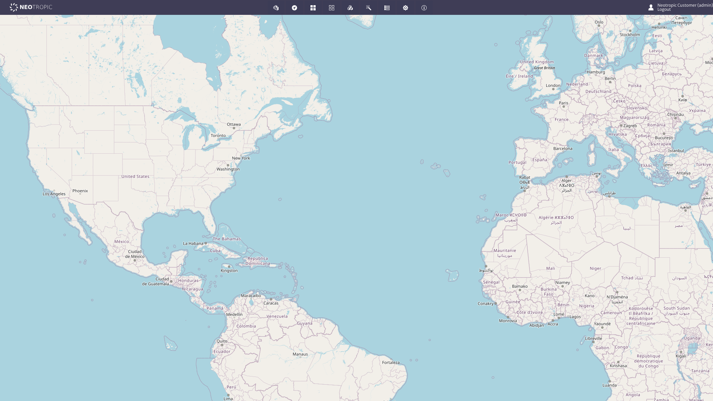
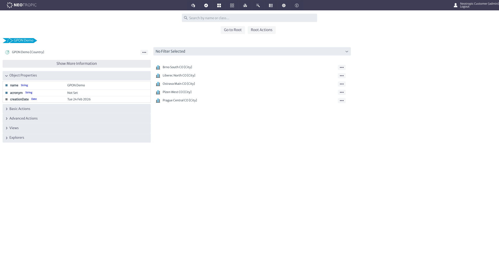
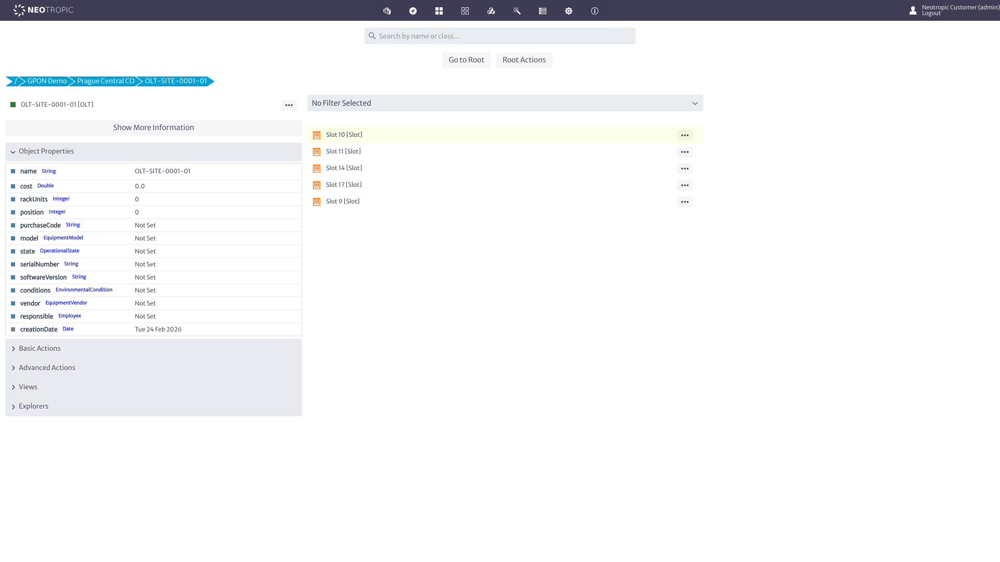
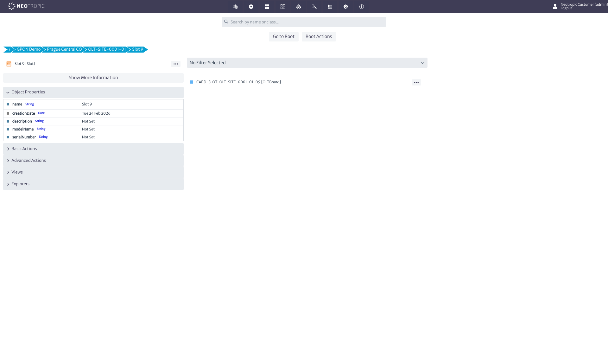
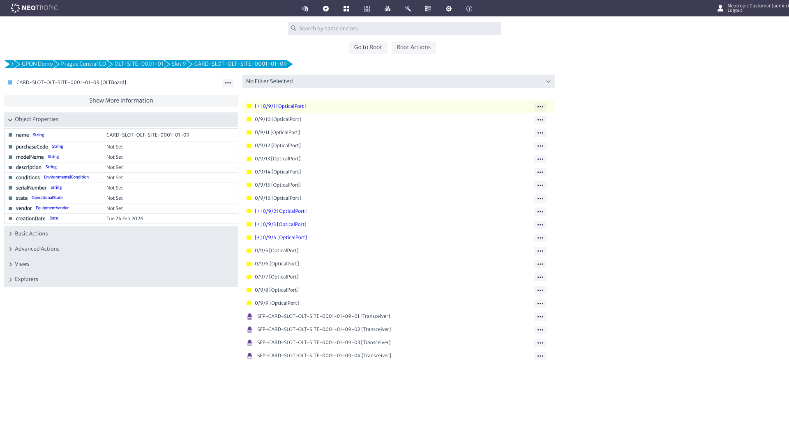
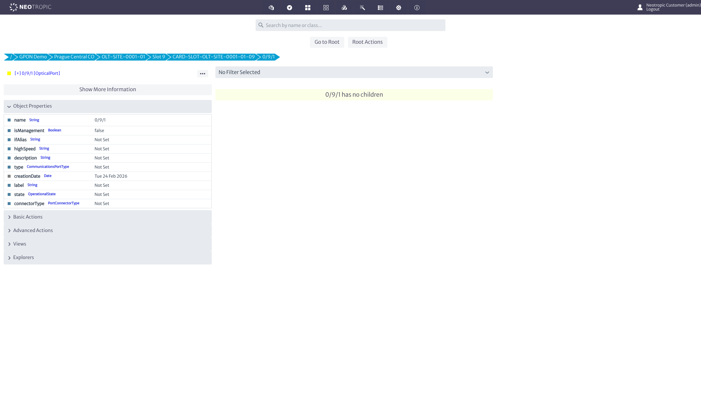
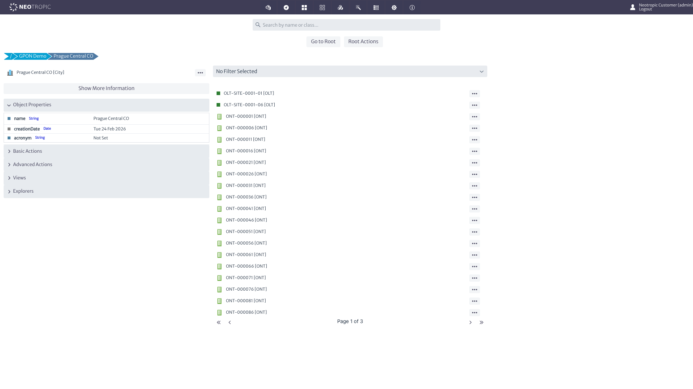
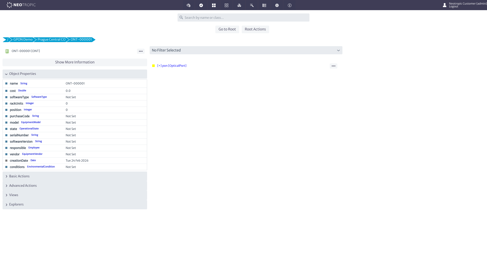
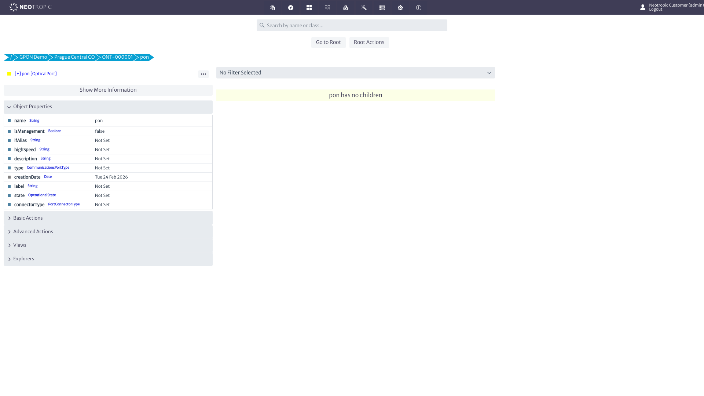

# Kuwaiba GPON Demo Walkthrough

A guided tour of the GPON inventory loaded into Kuwaiba 2.1 by the migration demo pipeline. Kuwaiba is an open-source telecom inventory platform with a hierarchical containment model — you navigate by drilling down from a country to a city to a device to its internal components.

---

## 01 — Login Page

Kuwaiba 2.1 is an open-source enterprise inventory management system built for telecom networks. The login page runs as a Vaadin single-page application. All demo data was loaded via the SOAP API using the automated `run_demo.py` pipeline.

---

## 02 — Dashboard

After login, Kuwaiba presents a world map and a toolbar of module icons. The key module for inventory browsing is **Navigation** (the compass icon), which provides the drill-down containment view. Other modules cover physical topology, logical views, services, and administration.

---

## 03 — Navigation Module

The Navigation module starts with a search bar and two buttons: **Go to Root** loads the top-level containment tree, and **Root Actions** provides administrative operations. This is the entry point for exploring any object in the inventory.

---

## 04 — Root Tree

Clicking **Go to Root** reveals the top-level objects: continents and countries. The **GPON Demo** country node contains all demo data — five central office sites with their complete GPON equipment hierarchy. Other entries (Africa, America, etc.) are Kuwaiba defaults.

---

## 05 — Cities

Drilling into **GPON Demo** shows five central office sites in the right panel: Brno South CO, Liberec North CO, Ostrava Main CO, Plzen West CO, and Prague Central CO. The left panel shows the country's properties. Each city contains the OLTs, splitters, and ONTs deployed at that location.

---

## 06 — Prague Central CO

Prague Central CO lists all equipment at this site: 2 OLTs (optical line terminals) and dozens of ONTs (customer premises devices), with pagination. This flat view shows everything contained within the city — Kuwaiba's containment model places devices directly under their physical location.

---

## 07 — OLT Detail

Clicking **OLT-SITE-0001-01** shows its property sheet on the left (name, cost, serial number, vendor, etc.) and its chassis slots on the right. The OLT contains 5 slots — each capable of holding a GPON line card. The breadcrumb trail at the top shows the full path: / > GPON Demo > Prague Central CO > OLT-SITE-0001-01.

---

## 08 — Slot and Line Card

Inside Slot 9, a single child is visible: **CARD-SLOT-OLT-SITE-0001-01-09**, an OLTBoard (GPON line card). The slot's properties show its name, creation date, and model info. In real OLT hardware, slots are hot-swappable bays for field-replaceable line card modules.

---

## 09 — GPON Ports and Transceivers

The OLTBoard reveals 16 **OpticalPort** children following the `0/slot/port` naming convention (0/9/1 through 0/9/16) plus 4 **Transceiver** (SFP) modules. Ports marked with **[+]** have active fiber connections to downstream splitters. This is the physical interface layer of the GPON tree.

---

## 10 — Port Detail

Clicking port **0/9/1** shows its properties: name, management flag, alias, speed, description, and port type. The **[+]** prefix indicates this port has an OpticalLink connection to a downstream device — following that link would trace the fiber path to a splitter and ultimately to customer ONTs.

---

## 11 — Back to Prague (Breadcrumb)

Using the breadcrumb trail, we navigate directly back to **Prague Central CO** without retracing every intermediate step. This is Kuwaiba's equivalent of a "back" button — clicking any breadcrumb segment jumps to that level of the hierarchy. The paginated equipment list is visible again.

---

## 12 — ONT Detail

**ONT-000001** is a customer premises optical network terminal. The property sheet shows the device name, cost, rack position, serial number, vendor, and creation date. In a real migration, this record links to the subscriber and represents the last mile of the GPON fiber network.

---

## 13 — ONT PON Port

Drilling into the ONT reveals its **pon** port — an OpticalPort that connects back upstream through a splitter to the OLT. The **[+]** prefix confirms this port has an active OpticalLink connection. The right panel shows "pon has no children" — this is the leaf node of the GPON tree, the termination point where the fiber network reaches the customer.

---

*Generated by the BMAD migration-inventory demo pipeline.*
