# NetBox GPON Demo Walkthrough

A guided tour of the GPON inventory loaded into NetBox v4.2 by the migration demo pipeline.

---

## 01 — Login Page

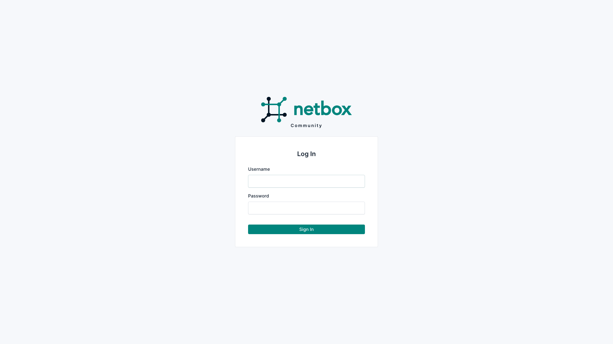

NetBox v4.2 is an open-source network DCIM and IPAM tool. This is the login screen of a fresh instance running in Docker. All demo data was loaded via the automated `run_demo.py` pipeline using the NetBox REST API.

---

## 02 — Dashboard

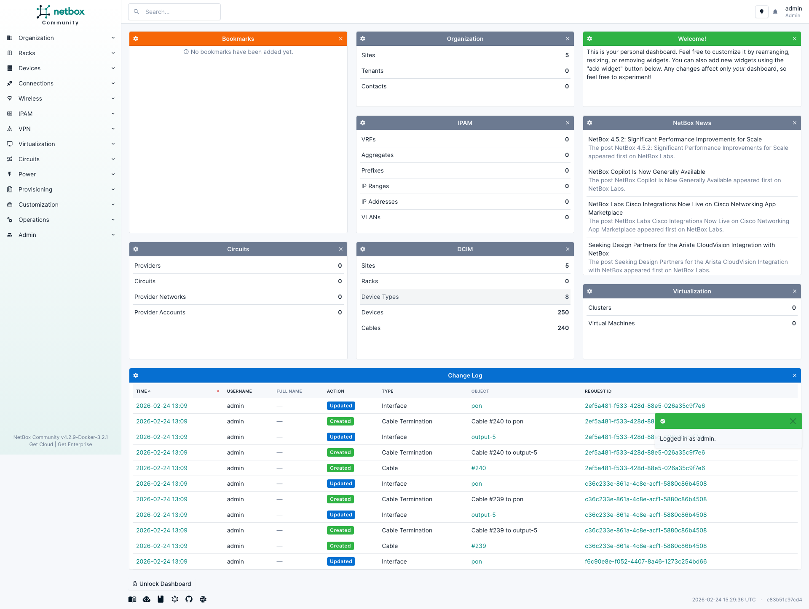

The dashboard after login shows the GPON inventory has been loaded. The DCIM section lists sites, device types, devices, cables, and modules — all created automatically by the migration pipeline. This gives operators an immediate overview of the network's scope.

---

## 03 — Sites List

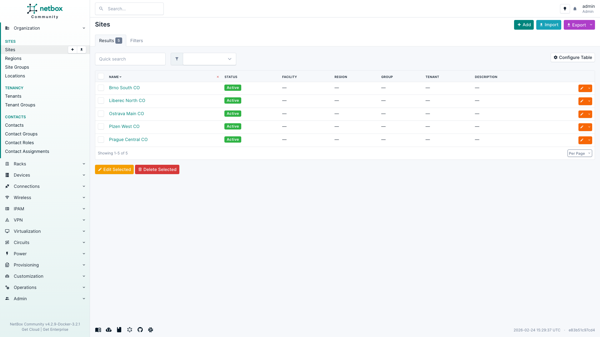

Five central office (CO) sites represent the physical locations where GPON equipment is deployed. Each site corresponds to a real-world CO with OLTs, splitters, and ONTs. Sites are the top-level organizational unit in NetBox's DCIM hierarchy.

---

## 04 — Site Detail

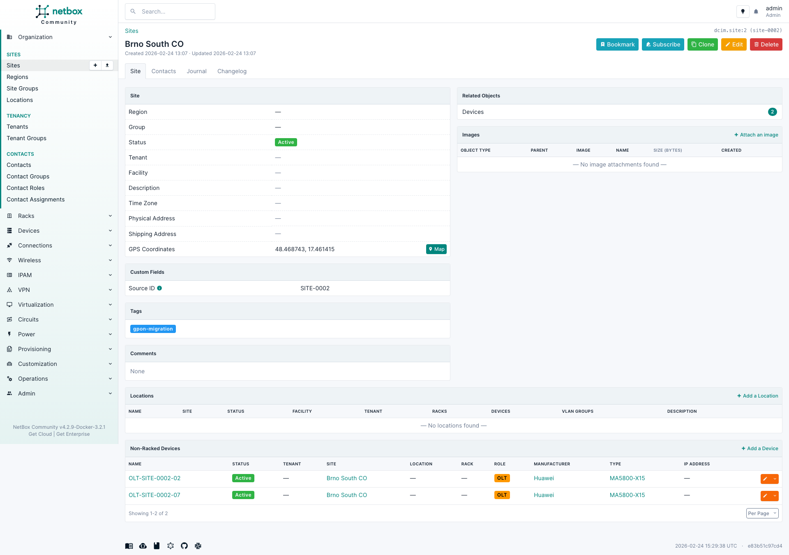

Drilling into Prague Central CO shows the devices assigned to this site. The detail view lists OLTs, splitters, and ONTs deployed at this location. This mirrors how a network operator would browse their inventory — starting from a physical location and drilling down to equipment.

---

## 05 — All Devices

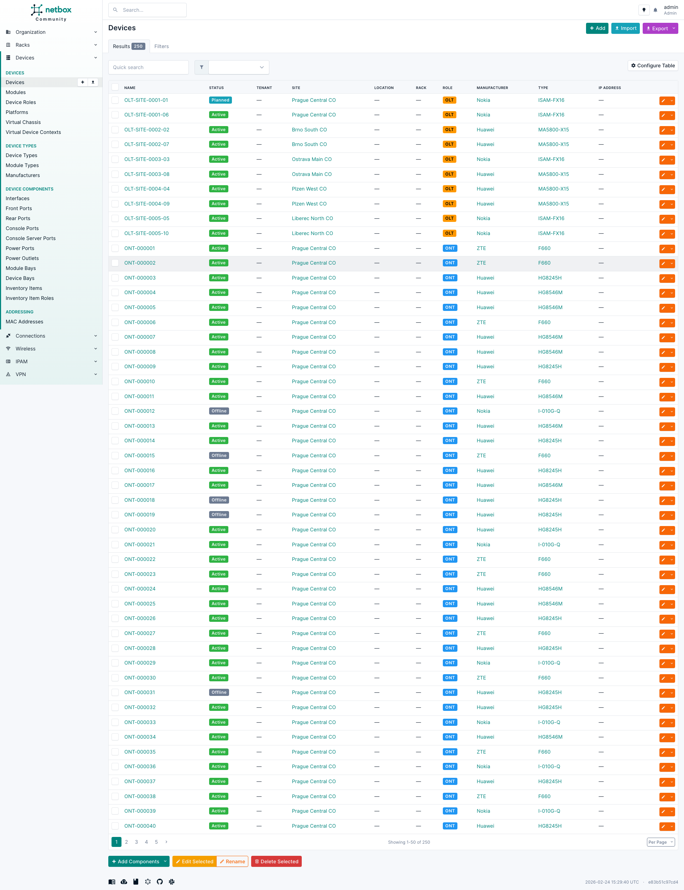

The full device list shows all 250 devices in the demo: 10 OLTs, 40 splitters, and 200 ONTs. Each device has a role, type, site, and status. NetBox's filtering and search capabilities make it easy to navigate large inventories — a key advantage over spreadsheet-based tracking.

---

## 06 — OLT Devices

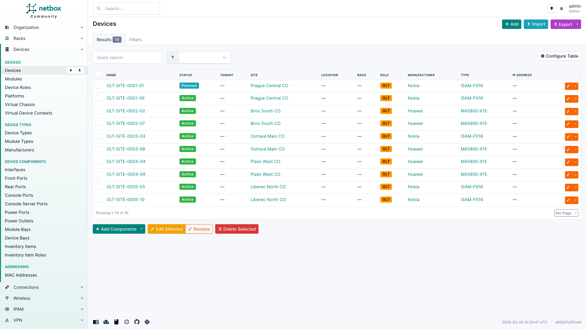

Filtering by the OLT role reveals 10 optical line terminals from three vendors: Huawei, Nokia, and ZTE. Each OLT serves as the head-end of a PON tree, aggregating traffic from splitters and ONTs. The device type column shows the specific chassis model.

---

## 07 — OLT Detail

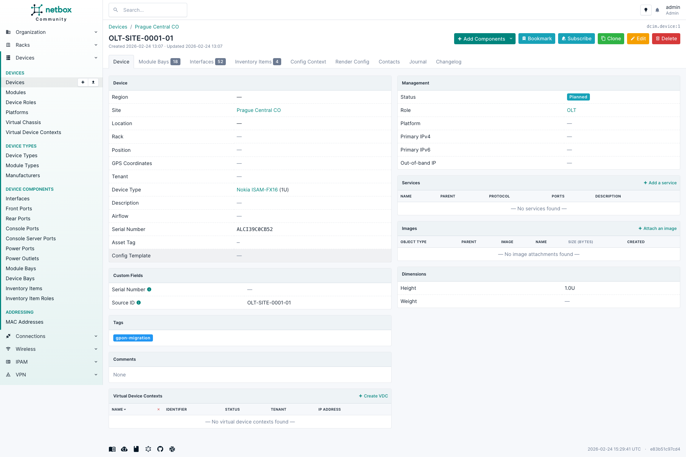

An individual OLT's detail page shows vendor, model, serial number, site assignment, and status. This is the information that was extracted from the source system (or generated synthetically) and transformed through the intermediate format before loading into NetBox.

---

## 08 — OLT Module Bays

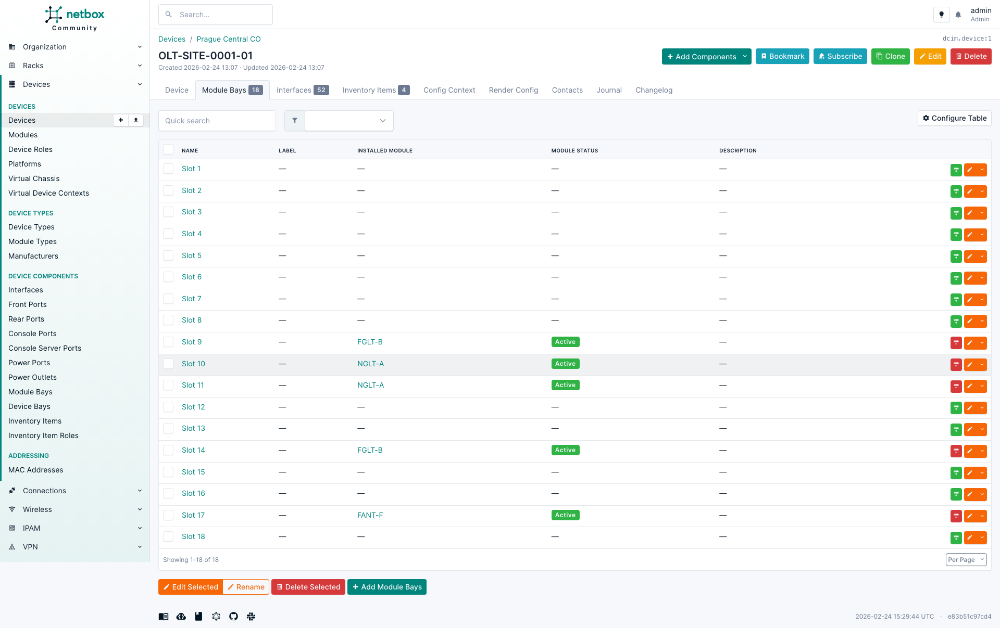

The module bays tab shows the chassis slots and installed GPON line cards. Each slot can hold a line card module that provides multiple GPON ports. The modular design reflects real OLT hardware where line cards are hot-swappable field-replaceable units.

---

## 09 — OLT Interfaces

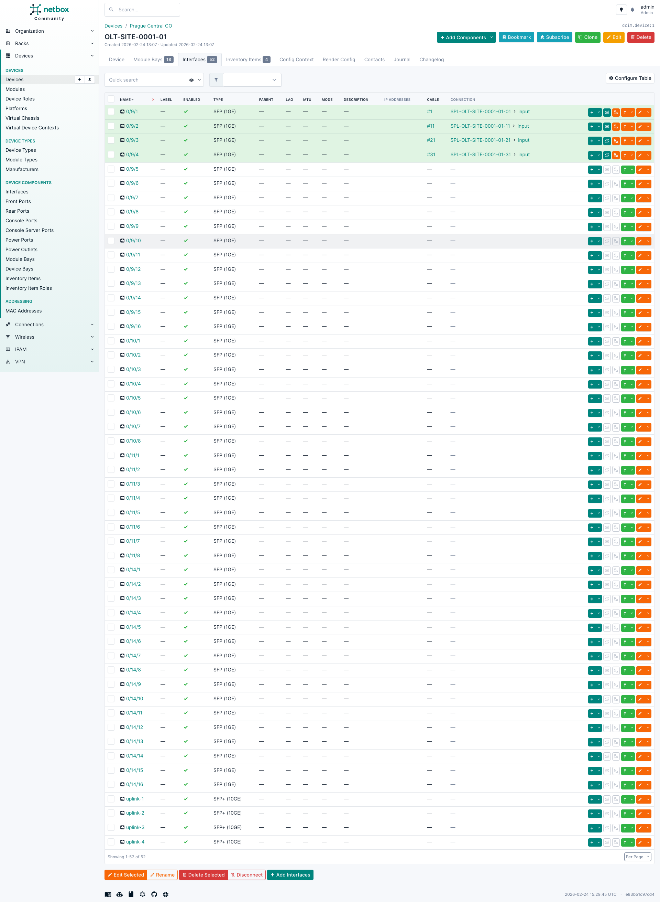

The interfaces tab lists all GPON ports on this OLT, following the standard `0/slot/port` naming convention. Each port represents a PON interface that connects downstream to a splitter or directly to an ONT. Interface naming is preserved from the source system through the migration.

---

## 10 — Cables List

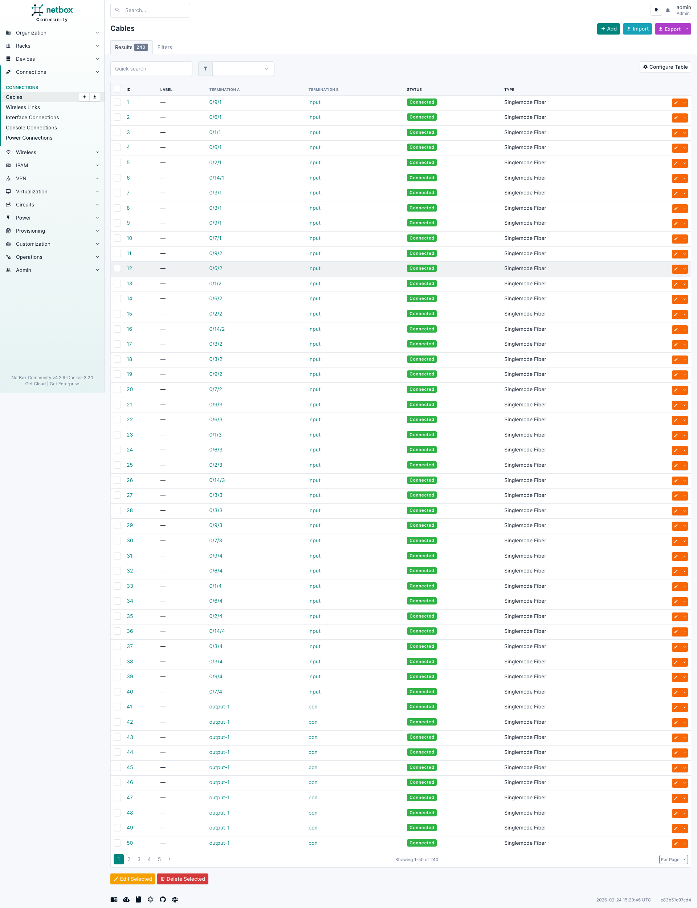

The cables view shows all fiber connections in the GPON network. Each cable represents a physical single-mode fiber (SMF) link between two ports. Cables connect OLT ports to splitter inputs, and splitter outputs to ONT PON ports, forming the tree topology.

---

## 11 — Cable Detail

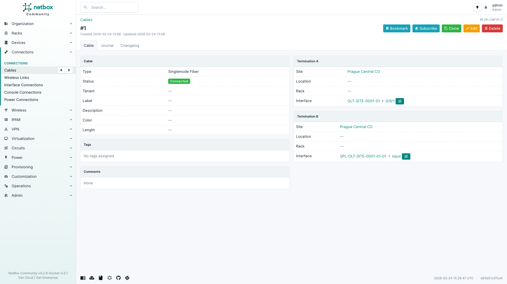

A single cable detail shows the A-side and Z-side terminations — for example, an OLT GPON port connected to a splitter's input port. The cable type (SMF) and connection endpoints are tracked, enabling end-to-end path tracing through the GPON tree.

---

## 12 — Splitter Detail

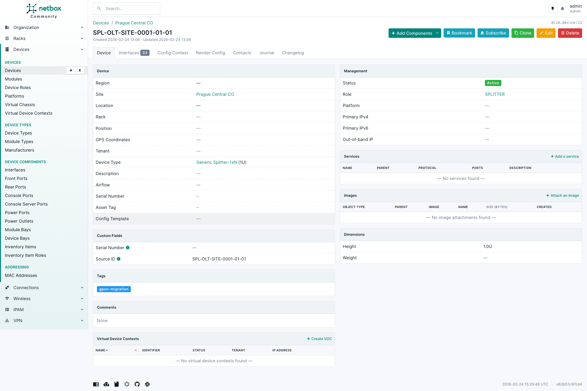

A passive optical splitter with one input port and N output ports. Splitters divide the optical signal from the OLT to multiple ONTs. The interface list shows the input port (connected upstream to the OLT) and output ports (connected downstream to ONTs or cascaded splitters).

---

## 13 — ONT Detail

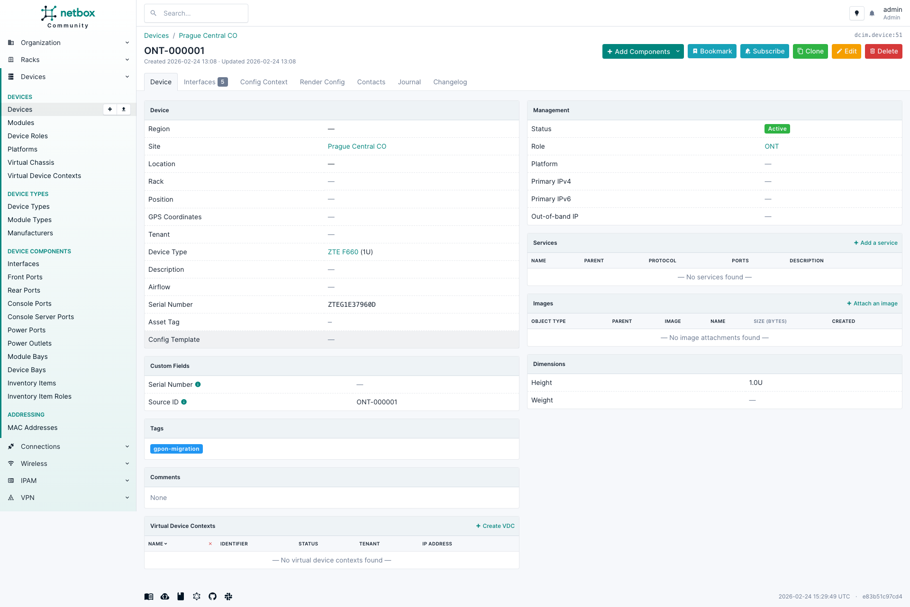

A customer-premises ONT (optical network terminal) is the endpoint of the GPON tree. The detail view shows the device model, serial number, and PON port. In a real migration, this record links back to the customer service and represents the last mile of the fiber network.

---

*Generated by the BMAD migration-inventory demo pipeline.*
